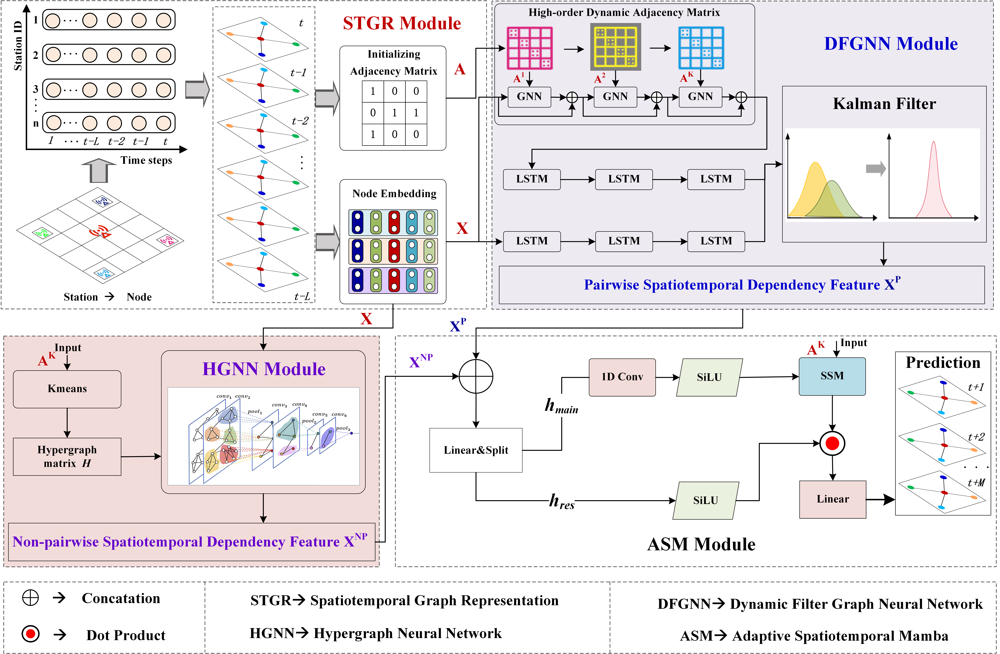

# ⛷️MVSTH:Multi-view  Spatiotemporal Heterogeneity Synergistic Learning for Mobile  Traffic Prediction

The code repository is now available. This is the official repository of our work `MVSTH`, the paper is currently posted on ArXiV.


## Requirements

- PyTorch==1.11.0
- Python==3.8.10
- numpy==1.22.4
- pandas==2.0.3
- einops==0.7.0
- argparse
- dataclasses
- typing
- time
- math


## Project Code Architecture

```
/username/MVSTH/  
              |datasets/
              |        |Milano/
              |        |      |adi_mat_milan.npy
              |        |      |milano_internet.npy
              |        |Trentino/
              |        |      |adi_mat_trentino.npy
              |        |      |trentino_internet.npy
              |main.py  
              |modules.py  
              |prepare.py  
              |model.py  
              |train_MSESMmamba.py
```


## Datasets

(1) Milano: `Milano` dataset is among the most popular benchmark in ST Data Mining & Network Traffic Forecasting. You can find the source data at [here](https://dataverse.harvard.edu/dataset.xhtml?persistentId=doi:10.7910/DVN/EGZHFV).

(2) Trentino: `Trentino` is an open-sourced Network Traffic dataset. You can also access the raw data at [here](https://dataverse.harvard.edu/dataset.xhtml?persistentId=doi:10.7910/DVN/QLCABU).

## Model Architecture



## Model Training/Testing

Using the following commands to Train/Test STG_Mamba model on `Milano`, `Trentino` respectively. You can also optionally change the model parameters in the file `main.py`.


```bash
# milano_internet
sh scripts/milan/run.sh
```

```bash
# Trentino_internet
sh scripts/Trentino/run.sh
```

```
## Citation

If you find this repository useful in your own research, please cite our work.
```
